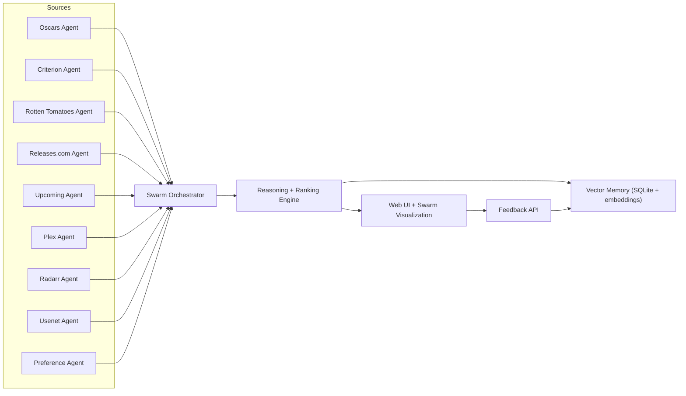

# Majic Movie Selector

Agentic movie recommendation engine and web app that:

- Aggregates from Oscars, Criterion, Rotten Tomatoes, Releases.com, upcoming releases, Plex, Radarr, and NZBGeek RSS
- Uses a reasoning engine with transparent score breakdowns
- Falls back to your own taste memory via vector similarity on prior likes/dislikes
- Visualizes a swarm of source agents in the UI

## 1. Architecture



## 2. Quick Start

```bash
python3 -m venv .venv
source .venv/bin/activate
pip install -e .[dev]
cp .env.example .env
uvicorn app.main:app --reload --host 127.0.0.1 --port 8080
```

Open [http://127.0.0.1:8080](http://127.0.0.1:8080).

## 3. Integrations

All integrations are optional. If keys are missing, agents are marked `skipped` and recommendations still run.

- `TMDB_API_KEY`: live upcoming releases from TMDB
- `ROTTENTOMATOES_LIST_URL`: Rotten Tomatoes browse page parsed via JSON-LD
- `RELEASES_URL`: Releases.com upcoming page (falls back to local seed if blocked)
- `ROGEREBERT_REVIEWS_URL`: RogerEbert reviews source (filtered to 2025/2026)
- `PLEX_BASE_URL` + `PLEX_TOKEN`: Plex library availability
- `RADARR_BASE_URL` + `RADARR_API_KEY`: Radarr tracked movies
- `NZBGEEK_RSS_URL` + `NZBGEEK_API_KEY`: NZBGeek RSS movie feed discovery
- `USENET_BASE_URL` + `USENET_API_KEY`: legacy Newznab/Usenet endpoint support

Settings and integration tests are managed from the web app at `/integrations`.

### Plex notes
Use a Plex token from your server account and set `PLEX_BASE_URL`, for example `http://192.168.1.20:32400`.

### Radarr notes
Set `RADARR_BASE_URL`, then add your API key from `Settings -> General -> Security`.

### Usenet notes
The current client expects Newznab JSON shape (`/api?t=search&cat=2000&o=json`).

## 4. Reasoning Engine

Each recommendation score is weighted by:

- Awards signal (`oscars`, winner/nominee)
- Curation signal (`criterion`)
- Critic consensus signal (`rottentomatoes`)
- Release signal (`releases`, `upcoming`)
- Release urgency (`upcoming` date proximity)
- Availability signal (`plex`, `radarr`, `usenet`)
- Preference similarity (vector memory from feedback)
- Unusual discovery boost (`usenet` rare markers)

The UI shows per-title reason lines and numeric contributions.

## 5. API Endpoints

- `GET /api/recommendations?user_id=default&count=12`
- `POST /api/feedback`
- `GET /api/feedback/{user_id}`
- `GET /api/integrations`

Feedback body:

```json
{
  "user_id": "default",
  "movie_id": "criterion:1017",
  "title": "Parasite",
  "liked": true,
  "genres": ["Thriller", "Drama"],
  "year": 2019,
  "overview": "..."
}
```

## 6. Tests

```bash
pytest
```

## 7. What to Productionize Next

1. Replace seed datasets with scheduled sync jobs for full Oscars and Criterion catalogs.
2. Add auth and per-user accounts.
3. Add background job queue (Celery/RQ) for periodic ingestion and Usenet polling.
4. Add stronger parser for Usenet titles (year/quality/duplicates).
5. Optionally add LLM natural-language explanation layer on top of the rule trace.
